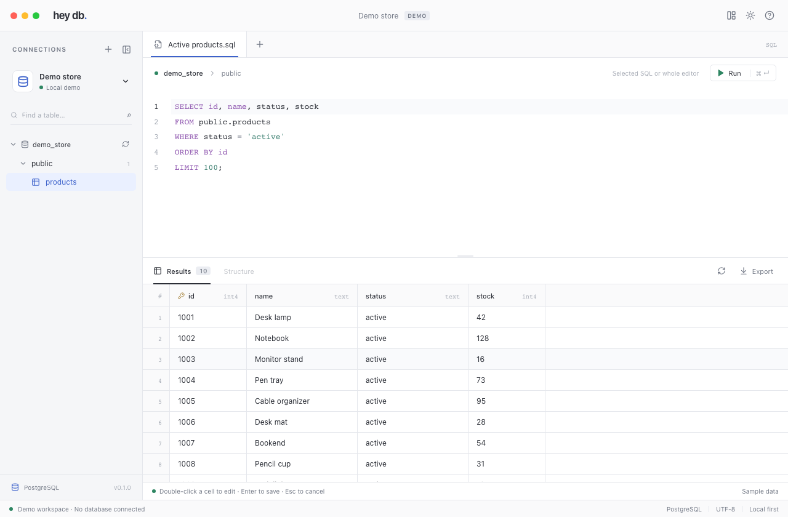

# hey db

**A focused PostgreSQL desktop app for the work you do every day.**

Browse your database, write SQL, and edit query results in a clean workspace. Open source, local-first, and built with Tauri 2 and Rust.

[Download from heymydb.com](https://heymydb.com) · [Request a feature](https://github.com/heysmmprovider/hey-db/issues/new?template=feature_request.yml) · [Contribute](CONTRIBUTING.md)



## Install

Download hey db from **[heymydb.com](https://heymydb.com)**, or use the installer included in this repository. You do not need Node.js, Rust, or a development setup to use the app.

| Download | Requirements |
| --- | --- |
| [hey db 0.1.0 for Mac — Apple Silicon (.dmg)](downloads/hey-db-0.1.0-macos-arm64.dmg?raw=true) | macOS 13 Ventura or later; an M-series Mac |

1. Open the downloaded `.dmg` file.
2. Drag **hey db** into **Applications**.
3. Open hey db, add your PostgreSQL connection, or try the built-in demo with synthetic data.

This preview is ad-hoc signed and is **not Apple-notarized**. macOS may block the first launch because the developer cannot be verified. If you trust your download, follow [Apple’s instructions for opening an unnotarized app](https://support.apple.com/en-us/102445).

[Installer details and checksum](downloads/README.md). The included installer is for Apple Silicon only. Intel Mac, Windows, and Linux installers are not included; developers can [build from source](docs/development.md#build). Windows and Linux have not yet received manual platform QA.

## What you can do

- Saved PostgreSQL connections, verified TLS, optional system credential storage, and read-only connections.
- Schema explorer with table/view discovery, columns, primary keys, and index definitions.
- SQL tabs, PostgreSQL highlighting, basic schema completion, selected-statement execution, and cancellation.
- A result grid that virtualizes both rows and columns. Integers, decimals, timestamps, and other values remain strings so JavaScript cannot round your data.
- Inline cell edits, pending-change highlights, discard, parameterized UPDATE previews, and transactional Apply.
- CSV export of the loaded result, with spreadsheet-formula protection.
- System, light, and dark appearance; a resizable SQL pane; a collapsible sidebar.
- An explicit, in-memory demo with synthetic data. The demo only executes its supplied sample queries.

PostgreSQL is the focus of this release. The database layer is kept separate from the interface to make future database support easier to add.

## Edit a result

```sql
SELECT id, name, status, stock
FROM public.products
WHERE status = 'active'
ORDER BY id
LIMIT 100;
```

1. Double-click `Monitor stand`, type `Monitor Holder`, and press Enter. The cell is marked as pending.
2. Click **Apply changes** to review the generated statements and parameter values.
3. Click **Apply update** to save the pending changes, or discard them to keep the original values.

The generated statement uses the original primary key and checks the originally loaded value:

```sql
UPDATE ONLY "public"."products"
SET "name" = $1
WHERE "id" = $2
  AND "name"::text IS NOT DISTINCT FROM $3;
```

Parameters are `Monitor Holder`, `1003`, and `Monitor stand`. They are sent separately using PostgreSQL's text parameter format; values are never interpolated into SQL. NULL and empty strings are distinct. Multi-column primary keys are supported.

All staged rows commit in one transaction. If an edited value changed externally, a row was deleted, a constraint fails, or any update affects a number of rows other than one, the batch rolls back. Table identity and projected column metadata are checked again before applying. Database triggers and rules retain their normal PostgreSQL behavior.

Results are editable only for direct columns from one ordinary table and when the entire primary key is selected. Views, joins, expressions, aggregates, DISTINCT, CTEs, inherited/partitioned tables, missing keys, and duplicate projections remain read-only. Primary keys, identity columns, and generated columns cannot be edited in this release.

## Local data and privacy

There is no account, telemetry, hosted backend, or remote UI. The application connects directly to the PostgreSQL host you select.

- Connection metadata is stored in Tauri's per-user application-data directory (`~/Library/Application Support/app.heydb.desktop/` on macOS).
- Remembered passwords use macOS Keychain, Windows Credential Manager, or Linux Secret Service. Without “Remember password,” the password is used for the connection and is not written to settings.
- SQL tabs, loaded results, and pending edits stay in memory. Closing the application discards them; pending edits prompt before closing. There is no persistent SQL history in 0.1.
- CSV files are written only to a destination you choose. Exports include loaded values, excluding staged edits; leading spreadsheet formula characters are prefixed with an apostrophe.
- The application does not log SQL text, credentials, or result contents. Error messages are shown locally.
- Use synthetic data in issues, tests, screenshots, and contributions. Never commit connection settings, database dumps, credentials, certificates, or `.env` files.

TLS defaults to certificate and hostname verification. The unencrypted option is intended for local development. Custom CA selection and SSH tunnels are not implemented yet.

## Current scope

Each Run executes one statement in an application-managed transaction. Explicit transaction/session commands, COPY, and procedures are not supported. Commands that PostgreSQL forbids inside a transaction (such as VACUUM) are therefore not supported yet. There is a 120-second statement timeout and a five-second lock timeout.

Results are limited to 1,000 rows and 8 MiB of retained values. When the limit is reached, the remainder is canceled and that query's transaction is rolled back; oversized write results return an error without committing. A single server row can still require transient memory before its size is checked. Use WHERE, ORDER BY, and LIMIT to browse larger datasets. CSV exports include only loaded rows. Queries are serialized per connection; run separate sessions for independent work.

There is no persistent tab restore, full SQL semantic analysis, grid insertion/deletion, SQL file management, or support for other database engines yet. The Rust database boundary keeps future adapters separate from the interface.

## Have a feature in mind?

**[Request a feature](https://github.com/heysmmprovider/hey-db/issues/new?template=feature_request.yml)** — ideas are welcome, whether you need a small convenience or a new workflow. Tell us what you are trying to do, how you handle it today, and what would make it easier. Check [existing issues](https://github.com/heysmmprovider/hey-db/issues) first so related ideas can stay together.

Bug reports and pull requests are welcome too. See the [contribution guide](CONTRIBUTING.md) for how to help. Please use synthetic or redacted examples; never include credentials, connection strings, private hostnames, or customer data.

## Build and contribute

The stack is **Tauri 2 + Rust** for the desktop shell and database work, **React + TypeScript** for the interface, and **CodeMirror** for the SQL editor. Tauri uses the operating system’s webview.

With Node.js 22.12+, a current stable Rust toolchain, and the [Tauri prerequisites](https://v2.tauri.app/start/prerequisites/) installed:

```sh
git clone https://github.com/heysmmprovider/hey-db.git
cd hey-db
npm ci
npm run desktop
```

See the [development guide](docs/development.md) for platform builds, tests, and release packaging.

## Sponsors

Thanks to our sponsors for supporting hey db and its open-source development.

**[heysmmreseller.com](https://heysmmreseller.com)** · **[smmroyale.com](https://smmroyale.com)** · **[smmrangers.com](https://smmrangers.com)**

| | | |
| --- | --- | --- |
| [buycanadianfollowers.ca](https://buycanadianfollowers.ca) | [followboostme.com](https://followboostme.com) | [acquistafollower.com](https://acquistafollower.com) |
| [kopenvolgers.nl](https://kopenvolgers.nl) | [followzentrum.de](https://followzentrum.de) | [comprarseguidor.es](https://comprarseguidor.es) |
| [ukfollowers.co.uk](https://ukfollowers.co.uk) | [compraseguidores.mx](https://compraseguidores.mx) | [americanfollowers.com](https://americanfollowers.com) |
| [canadianfollowers.ca](https://canadianfollowers.ca) | [kopenlikes.nl](https://kopenlikes.nl) | [topfollowerkaufen.de](https://topfollowerkaufen.de) |
| [toplikeskaufen.de](https://toplikeskaufen.de) | [followkaufen.de](https://followkaufen.de) | [britishfollowers.co.uk](https://britishfollowers.co.uk) |

## License

[MIT](LICENSE). Free to use, modify, and distribute under the license terms.
